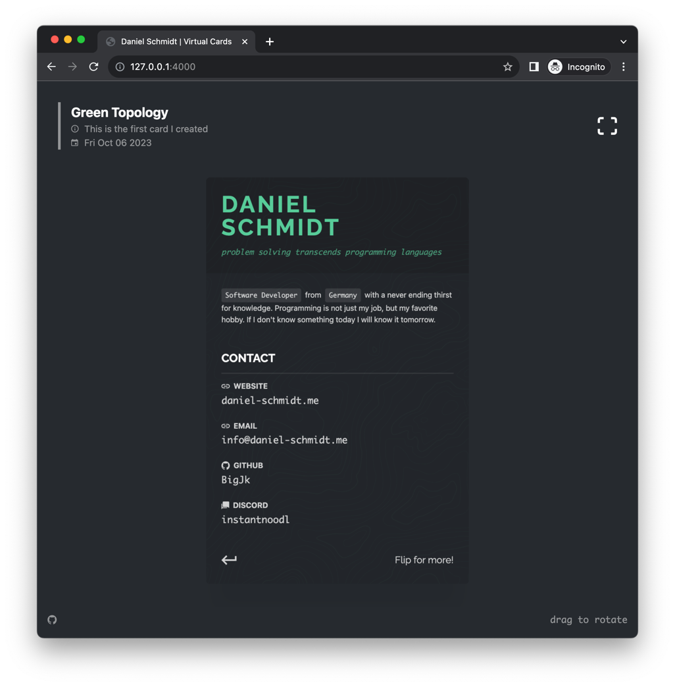

# virtualcard

## About

Business cards on paper are so 20th century. ``virtualcard`` is my simple virtual business card page. Cards are designed with web technologies. You can rotate them with your mouse or finger to see the back side.

I came up with the idea because I like the compact format of business cards, but I don't want to be locked in to a specific design for too long. With ``virtualcard`` I can change the design whenever I want.

Demo on my [website](https://daniel-schmidt.me).

## Technology

- Bundler: ``vite``
- Framework: ``mithril``
- CSS: ``tachyons`` + ``goober`` for some css-in-js sprinkles

## Future

- [ ] Make card creation framework-agnostic
- [ ] Make cards definable outside of this repo
- [ ] List cards in a gallery
- [ ] PWA support to add it to home screen
